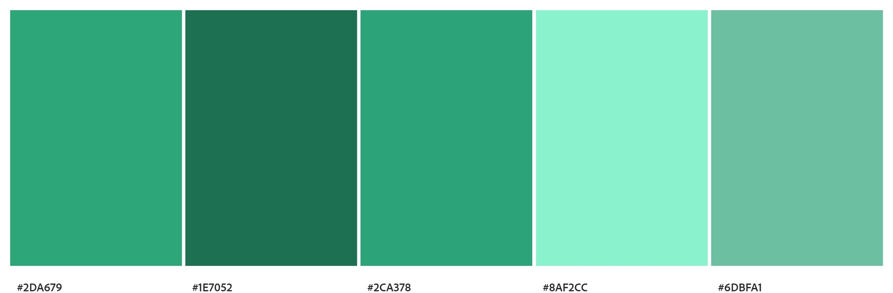
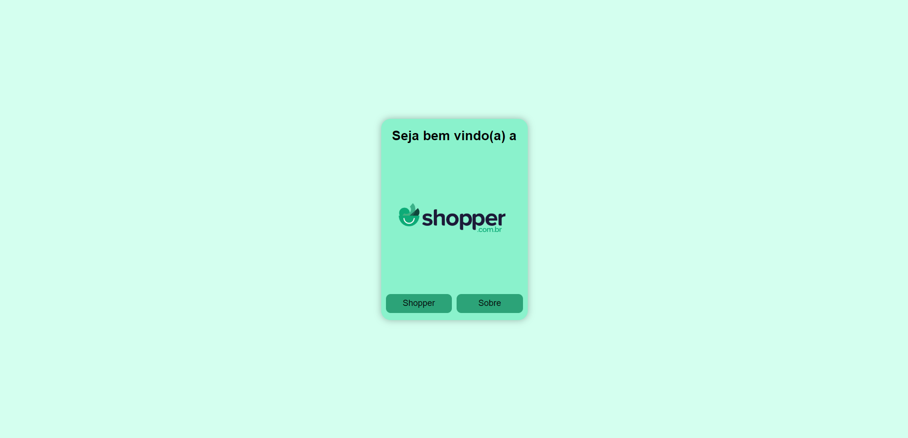
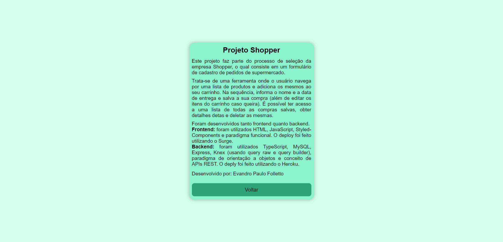
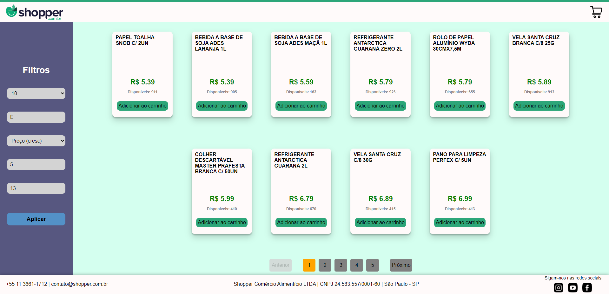
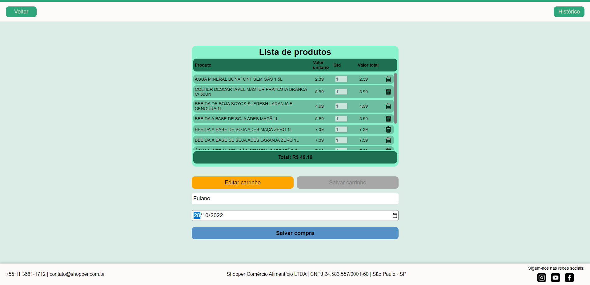
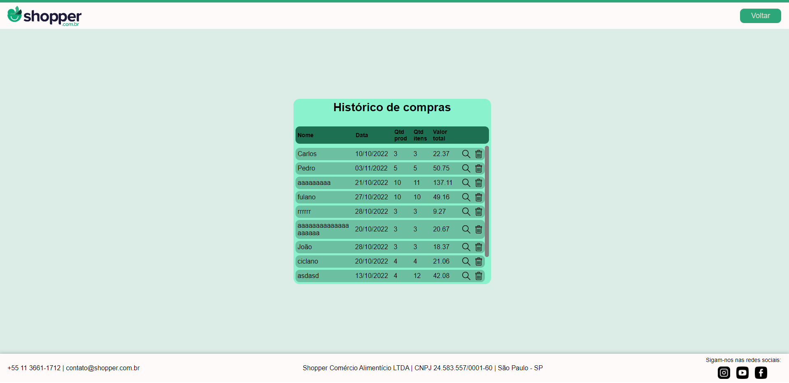
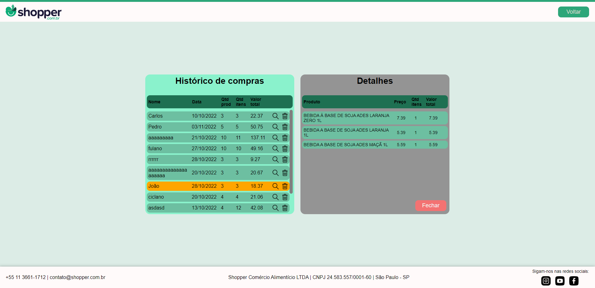

# `Projeto`
Teste técnico Shopper

# `Link`
[Clique aqui!](http://ec2-54-84-62-138.compute-1.amazonaws.com:3000)

# `Descrição`
Este projeto desenvolvido como parte do processo de seleção da empresa Shopper, o qual consiste em um formulário de cadastro de pedidos de supermercado.  
Neste projeto foram desenvolvidos tanto o fronted quanto backend.  
As requisições para a API utilizadas neste projeto foram:  
**[POST] getAllProducts:** endpoint utilizado para obter todos os produtos cadastrados.  
**[POST] addProductCart:** Endpoint utilizado para adicionar um novo produto dentro do carrinho. Os dados são passados no body da requisição.  
**[GET] getCart:** Endpoint utilizado para retornar todos os produtos que estão dentro do carrinho.  
**[PUT] updateCart:** Endpoint utilizado para atualizar os produtos que estão dentro do carrinho, quando uma alteração é salva. Os dados são passados no body da requisição.  
**[DEL] deleteProductCart:** Endpoint utilizado para deletar determinado produto do carrinho, passando o ID deste por path params.  
**[POST] addNewPurchase:** Endpoint utilizado para cadastrar nova compra.  
**[GET] getAllPurchases:** Endpoint utilizado para retornar todas as compras cadastradas.  
**[DEL] deletePurchase:** Endpoint utilizado para deletar uma compra cadastrada.  
**[GET] detailPurchase:** Endpoint utilizado para retornar os dados de uma determinada compra cadastrada.  

O deploy do backend foi feito na aws e pode ser encontrado [aqui](http://ec2-54-84-62-138.compute-1.amazonaws.com:3003).  

# `Modo de usar`
A aplicação é composta por cinco páginas diferentes: apresentação, sobre, produtos, carrinho e histórico:

**Página apresentação:** página inicial para a qual o usuário é direcionado inicialmente, composta por um texto de boas vindas e dois botões: o botão "Sobre" direciona para a página "sobre" e o botão "Shopper" que redireciona para a página da aplicação em si.

**Página sobre:** composta por um pequeno resumo sobre o projeto.

**Página produtos:** nesta página existem alguns componentes:
- cabeçalho: onde o usuário pode clicar sobre a logo, na parte esquerda superior, que redireciona para a página de apresentação ou clicar sobre o carrinho, na parte direita superior, que redireciona para o carrinho de compras.
- filtro: na parte esquerda central existem algumas opções de filtro e ordenação: a primeira é uma opção de escolher quantos produtos o usuário quer ver na tela, podendo ser 5, 10, 15, 20 e todos os produtos; a segunda opção é buscar por algum termo chave entre os nomes dos produtos; a terceira opção é ordenar os produtos entre algum critério: nome do produto, preço em ordem crescente ou decrescente e estoque por ordem crescente ou decrescente; a quarta opção é escolher um preço mínimo para filtragem e a quinta é escolher um preço máximo para filtragem.  
- lista de produtos: exibida na parte central, onde o usuário pode clicar sobre o botão "Adicionar ao carrinho" e ao fazer isso o botão automaticamente muda seu texto para "já adicionado" sendo possível verificar quais produtos já estão adicionados ao carrinho. Também é mostrada a quantidade de itens disponível em estoque.  
- rodapé: exibido na parte inferior, contém algumas informações da Shopper e também ícones que direcionam para as redes sociais da empresa.

**Página carrinho:** nesta página existem alguns componentes:  
- cabeçalho: onde o usuário pode clicar no botão "Voltar", na parte esquerda superior, que redireciona para a página de produtos ou clicar sobre o botão "Histórico", que redireciona para a página "Histórico".  
- lista de produtos: lista que contém todos os produtos que estão no carrinho, com as informações de nome, valor unitário, quantidade, valor total e também um botão "lixeira", onde é possível excluir determinado item do carrinho. Na parte inferior desta lista é exibido o valor total do carrinho.  
- botão "Editar carrinho", onde é possível editar a quantidade de itens de determinado produto.  
- botão "Salvar carrinho", habilitado apenas quando o botão de editar foi acionado. Sua função é atualizar o carrinho após o usuário fazer as edições que desejar.  
- campos de preenchimento de nome do usuário e data de entrega.  
- botão "Salvar compra" para o usuário salvar sua compra no histórico. Após clicar neste botão o carrinho é zerado.

**Página Histórico:** nesta página, inicialmente é exibida uma lista com o histórico de todas as compras, apresentando as informações de nome, data, quantidade de produtos diferentes, quantidade de itens, valor total, um botão para "ver detalhes" e um botão "lixeira" para deletar determinado registro do histórico. Ao clicar no botão de "ver detalhes" uma lista é aberta ao lado, com as seguintes informações: nome dos produtos, preço quantidade e valor total.

# `Tecnologias utilizadas`

# `Autor`
Evandro Paulo Folletto  
 
 
 
 

# `Paleta de cores utilizada`

# `Imagens`

### Página Start

### Página About

### Página Product

### Página Cart

### Página Detail

### Página Detail

